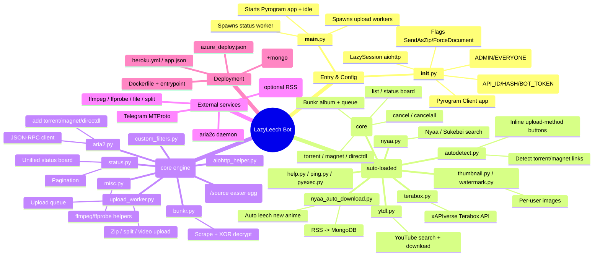
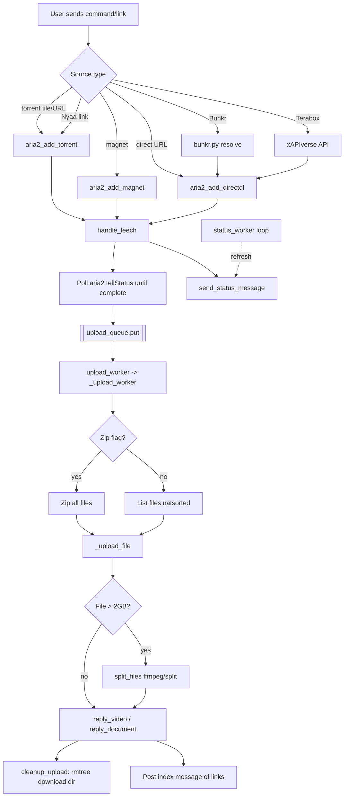
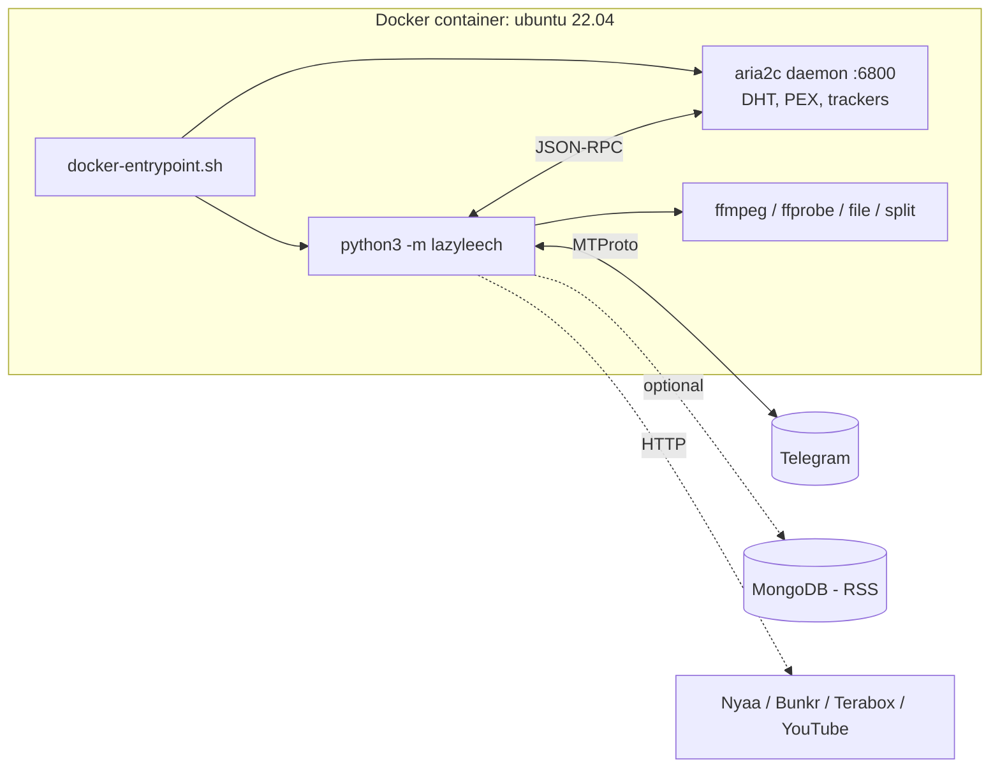

# LazyLeech — Repository Mindmap

A Telegram bot (built on **Pyrogram**) that leeches files from **torrents, magnets, direct
download links, Nyaa.si, Bunkr, Terabox and YouTube** and re-uploads them to Telegram.
Downloads are handled by an **aria2** daemon via JSON-RPC; uploads run through an async
worker queue that splits/zips files and renders a live status board.

---

## 1. High-Level Mindmap

---

## 2. Component Reference

### 2.1 Package Root — `lazyleech/`

| File | Responsibility |
|------|----------------|
| `__init__.py` | Reads all environment configuration, builds the Pyrogram `Client` (`app`), defines `LazySession` (lazy `aiohttp.ClientSession`), the `SendAsZipFlag`/`ForceDocumentFlag` marker classes, `help_dict`, `preserved_logs`, and the `memory_file()` helper. |
| `__main__.py` | Application bootstrap. Launches `MAX_CONCURRENT_UPLOADS` self-restarting `upload_worker` tasks, the `status_worker`, starts the client, and waits with `idle()`. On shutdown closes the Mongo client if `DB_URL` is set. |

**Key environment variables** (from `__init__.py` / `docker-entrypoint.sh` / `app.json`):

`API_ID`, `API_HASH`, `BOT_TOKEN`, `TESTMODE`, `EVERYONE_CHATS`, `ADMIN_CHATS`,
`LICHER_CHAT`/`LICHER_STICKER`/`LICHER_FOOTER`/`LICHER_PARSE_EPISODE`,
`PROGRESS_UPDATE_DELAY`, `MAGNET_TIMEOUT`, `LEECH_TIMEOUT`, `ARIA2_SECRET`,
`IGNORE_PADDING_FILE`, `MAX_CONCURRENT_UPLOADS`, `DB_URL`, `NYAA_RSS_LINKS`,
`RSS_RECHECK_INTERVAL`, `XAPIVERSE_KEY`.

### 2.2 Plugins — `lazyleech/plugins/`

Pyrogram auto-discovers these via `plugins={"root": ".../plugins"}`.

| Plugin | Commands / Triggers | Purpose |
|--------|---------------------|---------|
| `leech.py` | `torrent` `ziptorrent` `filetorrent`, `magnet` `zipmagnet` `filemagnet`, `directdl`/`direct` (+ zip/file variants), `queue`/`zipqueue`/`filequeue`, `listqueue`, `list`/`status`, `cancel` / `/cancel_<gid>`, `cancelall` | The core leech engine. Resolves the source, calls aria2, waits for download, queues the result for upload, and manages cancellation + the status board. Includes **Bunkr** album/file handling (semaphore-throttled task queue) and file-renaming/serialization (`name | newName {p,3}`). |
| `autodetect.py` | Any message (group=1) | Detects raw torrent files, Nyaa view/download URLs, and magnet links, then offers inline buttons: *Individual / Zip / Force Document / Delete*. |
| `nyaa.py` | `ts` `nyaa` `nyaasi`, `sts` `sukebei` | Searches Nyaa.si / Sukebei RSS, caches results 1h, paginated inline results. |
| `nyaa_auto_download.py` | `listrss` `addrss` `delrss`/`removerss` (admins) | **Optional** (needs `DB_URL`). APScheduler polls RSS feeds, stores last-seen titles in MongoDB, and auto-leeches new torrents to admin chats. |
| `ytdl.py` | `ytdl` + inline callback flow | YouTube search + format selection + download (video via `_tubeDl`, audio via `_mp3Dl`) using `youtube-dl`; posts result galleries, uses Telegraph for long text. Search state stored in `ytdl/ytsearch.json`. |
| `terabox.py` | `tera` `ziptera` `filetera` | Resolves Terabox links through the xAPIverse API, then hands direct URLs to `initiate_directdl`. |
| `thumbnail.py` | `thumbnail`/`set`/`save`, `clear`/`rm`/`del`/`remove`/`delete` | Per-user custom upload thumbnail (`<user_id>/thumbnail.jpg`), auto re-watermarked. |
| `watermark.py` | `watermark`/`set`/`save`, clear variants, `testwatermark` | Per-user watermark overlay applied to thumbnails (`<user_id>/watermark.jpg`). |
| `help.py` | `help` | Inline, module-based help menu populated from `help_dict`. |
| `ping.py` | `ping` | Liveness check → "Pong". |
| `pyexec.py` | `exec` (admins only) | Runs arbitrary async Python via AST rewriting; captures stdout/stderr. |

### 2.3 Utilities — `lazyleech/utils/`

| File | Responsibility |
|------|----------------|
| `aria2.py` | Async JSON-RPC client for the local aria2 daemon (`127.0.0.1:6800`): GID generation/ownership, `addTorrent`, `addUri` (magnet metadata-only + directdl), `tellActive`, `tellStatus`, `changeOption`, `remove`. |
| `upload_worker.py` | Consumes `upload_queue`. Optionally **zips** the torrent, iterates files (natsorted), applies renaming/serialization, **splits** >2 GB files (ffmpeg for video, `split` otherwise), generates/watermarks thumbnails, and uploads as video or document with progress callbacks. Handles cleanup of download dirs and cancellation via `stop_uploads`. |
| `status.py` | Maintains a single live **status message per chat** combining active aria2 downloads and active uploads, with progress bars, speed, ETA, and Next/Previous pagination. Refreshed by `status_worker` every `PROGRESS_UPDATE_DELAY`s. |
| `misc.py` | ffmpeg/ffprobe wrappers: `get_file_mimetype`, `split_files`, `get_video_info`, `generate_thumbnail`, `convert_to_jpg`, `watermark_photo`; plus `format_bytes`, `return_progress_string`, `calculate_eta`, and `allow_admin_cancel`. |
| `bunkr.py` | Bunkr scraper: fetch HTML, extract file id / album files, call Bunkr API, **XOR-decrypt** the time-keyed encrypted URL, resolve direct links + referer. |
| `aiohttp_helper.py` | Static `AioHttp` helper (json/text/read/status/redirect/headers) using `ujson`. |
| `custom_filters.py` | `callback_data` and `callback_chat` Pyrogram filter factories. |
| `__init__.py` | Registers the AGPL-mandated `/source` command (heavily obfuscated easter egg that surfaces the source-code link). |

### 2.4 `ytdl/`

Working area for the YouTube plugin: `ytsearch.json` (search-result store) and a
`downloads/` directory. `__init__.py` is a placeholder.

---

## 3. Primary Data Flow (Leech → Upload)

**Concurrency model**

- `MAX_CONCURRENT_UPLOADS` worker tasks pull from a shared `asyncio.Queue` (`upload_queue`).
- Each upload runs as a fire-and-forget task with a `cleanup_upload` done-callback.
- `bunkr_semaphore` serializes Bunkr downloads; a global `global_bunkr_queue` list is
  shown by `listqueue`.
- Cancellation maps: `leech_statuses`, `upload_statuses`, `upload_waits`,
  `stop_uploads`, `progress_callback_data`.

---

## 4. Runtime & Deployment

| File | Role |
|------|------|
| `Dockerfile` | Ubuntu 22.04 image; installs python3, ffmpeg, aria2, file, p7zip, git; installs `requirements.txt`; healthcheck on aria2 RPC. |
| `docker-entrypoint.sh` | Validates env vars, generates `ARIA2_SECRET`, loads `best_trackers.txt`, launches aria2c, then `python3 -m lazyleech`. |
| `docker-compose.yml` | `lazyleech` service (+ persistent volumes) and an optional `mongodb` service under the `rss` profile. |
| `run.sh` | Minimal non-Docker launcher (aria2 + bot, tailing logs). |
| `heroku.yml`, `app.json`, `azure_deploy.json` | Heroku container deploy + form, Azure ARM template. |
| `DEPLOY.md`, `data_requirements.md`, `README.md` | Documentation. |
| `requirements.txt` | pyrogram, tgcrypto, aiohttp, feedparser, bs4, motor, apscheduler, youtube-dl, etc. |
| `best_trackers.txt` | Tracker list injected into aria2. |
| `testwatermark.jpg` | Sample image for `/testwatermark`. |

---

## 5. Notable Implementation Details

- **Per-user workspace**: user files (thumbnails, watermarks, temp downloads) live under a
  directory named by the Telegram `user_id`.
- **GID ownership**: aria2 GIDs are prefixed with the user id so ownership/cancel rights can
  be checked without extra state (`is_gid_owner`).
- **File renaming & serialization**: `link | newName {p,3}` / `{s,4}` adds zero-padded
  prefixes/suffixes across multi-file torrents.
- **Large-file handling**: files >~2 GB are split — video via ffmpeg keyframe-copy segments,
  others via the `split` utility.
- **Bunkr decryption**: the API returns a Base64 URL encrypted with an hourly time-keyed XOR
  cipher (`SECRET_KEY_<timestamp//3600>`), decoded in `bunkr.py`.
- **AGPL compliance**: the obfuscated `/source` command in `utils/__init__.py` exposes the
  source link, as required by the license.
- **Admin-only power tools**: `/exec` (arbitrary code) and the RSS management commands are
  restricted to `ADMIN_CHATS`.
